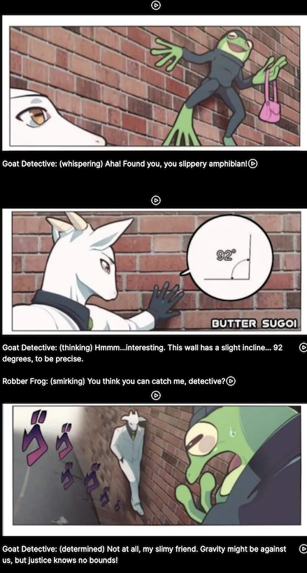

## Justice Defies Gravity

Starting from a cute comic strip, can we generate a narrated story with chatgpt and elevenlabs?

## elevenlabs

Josh = narrator
narrator = Josh
goat = Arnold
frog = Domi

## chatgpt

prompt:

```
help me write comic scripts for 3 panels

1. the first panel is a robber frog hiding in an alley, adhered to the wall with a purse in hand. the goat detective sees him

2. the goat detective feels the wall and realizes the wall has a slight incline of 92 degrees. the frog is not afraid.

3. the goat detective begins to walk up the wall towards the frog. the frog robber exclaims in fear.
```


